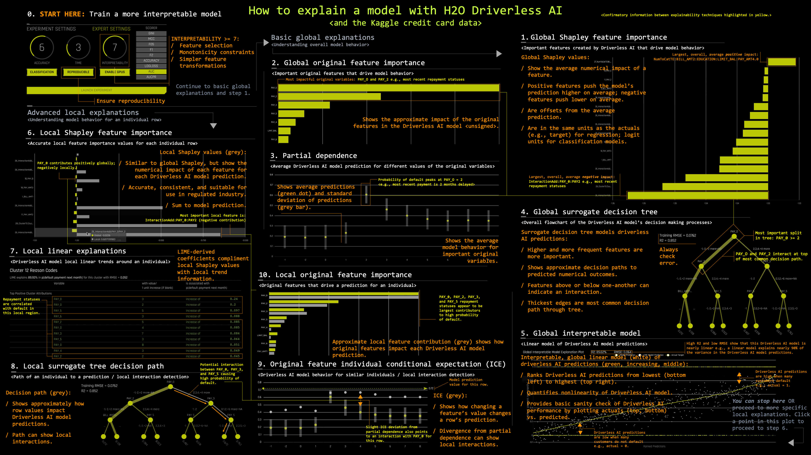
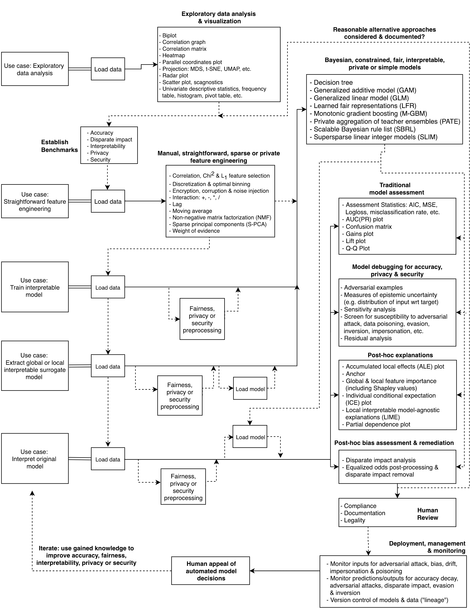

# Machine Learning Interpretability (MLI)

Machine learning algorithms create potentially more accurate models than linear models, but any increase in accuracy over more traditional, better-understood, and more easily explainable techniques is not practical for those who must explain their models to regulators or customers. For many decades, the models created by machine learning algorithms were generally taken to be black-boxes. However, a recent flurry of research has introduced credible techniques for interpreting complex, machine-learned models. Materials presented here illustrate applications or adaptations of these techniques for practicing data scientists.

**Want to contribute your own content?** Just make a pull request.

**Want to use the content in this repo?** Just cite the H2O.ai machine learning interpretability team or the original author(s) as appropriate.

### Contents

* [Practical MLI Examples](https://github.com/h2oai/mli-resources#practical-mli-examples)
  * [Installation of Examples](https://github.com/h2oai/mli-resources#installation-of-examples)
    * [Dockerfile](https://github.com/h2oai/mli-resources#dockerfile)
    * [Manual](https://github.com/h2oai/mli-resources#manual)
  * [Additional Code Examples](https://github.com/h2oai/mli-resources#additional-code-examples)
* [Testing Explanations](https://github.com/h2oai/mli-resources#testing-explanations)
* [Webinars/Videos](https://github.com/h2oai/mli-resources#webinarsvideos)
* [Booklets](https://github.com/h2oai/mli-resources#booklets)
* [Conference Presentations](https://github.com/h2oai/mli-resources#conference-presentations)
* [Miscellaneous Resources](https://github.com/h2oai/mli-resources#miscellaneous-resources)
* [References](https://github.com/h2oai/mli-resources#references)
  * [General](https://github.com/h2oai/mli-resources#general)
  * [Techniques](https://github.com/h2oai/mli-resources#techniques)

### Practical MLI examples

(A [Dockerfile](anaconda_py36_h2o_xgboost_graphviz/Dockerfile) is provided that will construct a container with all necessary dependencies to run the examples here.)

  * [Decision tree surrogate models](notebooks/dt_surrogate.ipynb)
  * [LIME (practical samples variant)](notebooks/lime.ipynb)
  * [LOCO (NA variant)](notebooks/loco.ipynb)
  * [Partial dependence and individual conditional expectation (ICE)](notebooks/pdp_ice.ipynb)  
  * [Sensitivity analysis](notebooks/sensitivity_analysis.ipynb)
  * [Monotonic models with XGBoost](notebooks/mono_xgboost.ipynb)
  * [Diabetes data set use case](https://github.com/jphall663/diabetes_use_case)  
  (Diabetes use case has different Dockerfile in seperate repo.)

#### Installation of Examples

##### Dockerfile

A Dockerfile is provided to build a docker container with all necessary packages and dependencies. This is the easiest way to use these examples if you are on Mac OS X, \*nix, or Windows 10. To do so:

  1. Install and start [docker](https://www.docker.com/).
  From a terminal:
  2. Create a directory for the Dockerfile. 
  `$ mkdir anaconda_py36_h2o_xgboost_graphviz`
  3. Fetch the Dockerfile from the mli-resources repo. 
  `$ curl https://raw.githubusercontent.com/h2oai/mli-resources/master/anaconda_py36_h2o_xgboost_graphviz/Dockerfile > anaconda_py36_h2o_xgboost_graphviz/Dockerfile`
  4. Build a docker image from the Dockefile. For this and other docker commands below, you may need to use `sudo`.  
  `$ docker build --no-cache anaconda_py36_h2o_xgboost_graphviz`
  5. Display docker image IDs. You are probably interested in the most recently created image.  
  `$ docker images`
  6. Start the docker image and the Jupyter notebook server. 
   `$ docker run -i -t -p 8888:8888 <image_id> /bin/bash -c "/opt/conda/bin/conda install jupyter -y --quiet && /opt/conda/bin/jupyter notebook --notebook-dir=/mli-resources --ip='*' --port=8888 --no-browser --allow-root"`
  7. List docker containers. 
  `$ docker ps`
  8. Copy the sample data into the Docker container. Refer to [GetData.md](data/GetData.md) to obtain datasets needed for notebooks. 
  `$ docker cp path/to/train.csv <container_id>:/mli-resources/data/train.csv`
  9. Navigate to the port Jupyter directs you to on your machine. It will likely include a token.

##### Manual

  Install:

  1. Anaconda Python 5.1.0 from the [Anaconda archives](https://repo.continuum.io/archive/).
  2. [Java](https://java.com/download).
  3. The latest stable [h2o](https://www.h2o.ai/download/) Python package.
  4. [Git](https://git-scm.com/downloads).
  5. [XGBoost](https://github.com/dmlc/xgboost) with Python bindings.
  6. [GraphViz](http://www.graphviz.org/).

  Anaconda Python, Java, Git, and GraphViz must be added to your system path.

  From a terminal:

  7. Clone the mli-resources repository with examples. 
  `$ git clone https://github.com/h2oai/mli-resources.git`
  8. `$ cd mli-resources`
  9. Copy the sample data into the mli-resources repo directory. Refer to [GetData.md](data/GetData.md) to obtain datasets needed for notebooks. 
  `$ cp path/to/train.csv ./data`
  9. Start the Jupyter notebook server. 
  `$ jupyter notebook`
  10. Navigate to the port Jupyter directs you to on your machine.

#### Additional Code Examples

The notebooks in this repo have been revamped and refined many times. Other versions with different, and potentially interesting, details are available at these locations:

* [O'Reilly Media GitLab](https://content.oreilly.com/oriole/Interpretable-machine-learning-with-Python-XGBoost-and-H2O)
* [github.com/jphall663](https://github.com/jphall663/interpretable_machine_learning_with_python)

### Testing Explanations

One way to test generated explanations for accuracy is with simulated data with known characteristics. For instance, models trained on totally random data with no relationship between a number of input variables and a prediction target should not give strong weight to any input variable nor generate compelling local explanations or reason codes. Conversely, you can use simulated data with a known signal generating function to test that explanations accurately represent that known function. Detailed examples of testing explanations with simulated data are available [here](https://github.com/h2oai/mli-resources/tree/master/lime_shap_treeint_compare/README.md). A summary of these results are available [here](https://www.oreilly.com/ideas/testing-machine-learning-interpretability-techniques).

### Webinars/Videos

* [Interpretable Machine Learning Meetup - Washington DC](https://www.youtube.com/watch?v=3uLegw5HhYk)
* [Machine Learning Interpretability with Driverless AI](https://www.youtube.com/watch?v=3_gm00kBwEw)
* [Interpretability in conversation with Patrick Hall and Sameer Singh](http://blog.fastforwardlabs.com/2017/09/11/interpretability-webinar.html)
* [NYC Big Data Science Meetup I (less technical)](https://www.youtube.com/watch?v=Q8rTrmqUQsU)
* [NYC Big Data Science Meetup II (more technical)](https://www.youtube.com/watch?v=RcUdUZf8_SU)  
* [H2O Driverless AI machine learning interpretability software walk-through (accompanies cheatsheet below)](https://www.youtube.com/watch?v=5jSU3CUReXY)
* O'Reilly Media Interactive Notebooks (Requires O'Reilly Safari Membership):
  * [Enhancing transparency in machine learning models with Python and XGBoost](https://www.safaribooksonline.com/oriole/enhancing-transparency-in-machine-learning-models-with-python-and-xgboost)
  * [Increase transparency and accountability in your machine learning project with Python](https://www.safaribooksonline.com/oriole/increase-transparency-and-accountability-in-your-machine-learning-project-with-python)
  * [Explain your predictive models to business stakeholders with LIME, Python, and H2O](https://www.safaribooksonline.com/oriole/explain-your-predictive-models-to-business-stakeholders-w-lime-python-h2o)
  * [Testing machine learning models for accuracy, trustworthiness, and stability with Python and H2O](https://www.safaribooksonline.com/oriole/testing-ml-models-for-accuracy-trustworthiness-stability-with-python-and-h2o)

### Booklets

* [An Introduction to Machine Learning Interpretability](http://www.oreilly.com/data/free/an-introduction-to-machine-learning-interpretability.csp)
* [Machine Learning Interpretability with H2O Driverless AI Booklet](http://docs.h2o.ai/driverless-ai/latest-stable/docs/booklets/MLIBooklet.pdf)

### Conference Presentations

* [Practical Techniques for Interpreting Machine Learning Models - 2018 FAT* Conference Tutorial](https://www.fatconference.org/static/tutorials/hall_interpretable18.pdf)
* [Driverless AI Hands-On Focused on Machine Learning Interpretability - H2O World 2017](http://video.h2o.ai/watch/9g8TrVXUfgYgKq4FReia7z)
* [Interpretable AI: Not Just For Regulators! - Strata NYC 2017](notes/strata_mli_sept_17.pdf)
* [JSM 2018 Slides](https://github.com/jphall663/jsm_2018_slides/blob/master/main.pdf)
* [ODSC 2018 Slides](https://www.slideshare.net/pramitchoudhary/model-evaluation-in-the-land-of-deep-learning-123891695)
* [H2O World SF 2019: Human-Centered ML](https://github.com/jphall663/h2oworld_sf_2019/blob/master/main.pdf)

### Miscellaneous Resources

* [Ideas on Interpreting Machine Learning - SlideShare](https://www.slideshare.net/0xdata/interpretable-machine-learning)
* [Predictive modeling: Striking a balance between accuracy and interpretability](https://www.oreilly.com/ideas/predictive-modeling-striking-a-balance-between-accuracy-and-interpretability)
* [Testing machine learning explanation techniques](https://www.oreilly.com/ideas/testing-machine-learning-interpretability-techniques)
* [Interpreting Machine Learning Models: An Overview](https://www.kdnuggets.com/2017/11/interpreting-machine-learning-models-overview.html)
* [H2O Driverless AI MLI cheatsheet (accompanies walk-through video above)](cheatsheet.png)

* Imperfect, incomplete, but one-page blueprint for human-friendly machine learning: [PNG](blueprint.png), [draw.io XML](blueprint.xml)

### General References

* [Towards A Rigorous Science of Interpretable Machine Learning](https://arxiv.org/pdf/1702.08608.pdf)
* [Ideas for Machine Learning Interpretability](https://www.oreilly.com/ideas/ideas-on-interpreting-machine-learning)
* [Fairness, Accountability, and Transparency in Machine Learning (FAT/ML) Scholarship](https://www.fatml.org/resources/relevant-scholarship)
* [Explaining Explanations: An Approach to Evaluating Interpretability of Machine Learning](https://arxiv.org/pdf/1806.00069.pdf)
* [A Survey Of Methods For Explaining Black Box Models](https://arxiv.org/pdf/1802.01933.pdf)
* [Trends and Trajectories for Explainable, Accountable and Intelligible Systems: An HCI Research Agenda](https://dl.acm.org/citation.cfm?id=3174156)
* [Interpretable Machine Learning by Christoph Molnar](https://github.com/christophM/interpretable-ml-book)
* [On the Art and Science of Machine Learning Explanations (JSM 2018 Proceedings paper)](https://github.com/jphall663/jsm_2018_paper/blob/master/jsm_2018_paper.pdf)
* [Toward Dispelling Unhelpful Explainable Machine Learning (ML) Misconceptions (Preprint/WIP)](https://github.com/jphall663/xai_misconceptions/blob/master/xai_misconceptions.pdf)
* [The Mythos of Model Interpretability](https://arxiv.org/pdf/1606.03490.pdf)
* [Challenges for Transparency](https://arxiv.org/pdf/1708.01870.pdf)
